``` mermaid
%%{init: {'theme':'dark', 'flowchart': {'curve': 'linear', 'htmlLabels': true}}}%%
flowchart TB
    A[/"Input Document<br/>(PDF)"/] -->|Parse & Extract| B["Text Processing<br/>(Cleaning, Normalization)"]
    B -->|Tokenize & Segment| C["Text Chunking<br/>(250-token spans)"]
    C -->|Refinement| D["Chunk Store<br/>(7 refined chunks)"]
    
    D -->|Embed| E["Embedding Model<br/>(all-MiniLM-L6-v2)"]
    E -->|Index| F[("Vector Store<br/>(FAISS IndexFlatIP)")]
    
    D -->|Extract Entities| G["Domain Ontology<br/>(Entity Definitions)"]

    %% Knowledge Graph Cluster Implementation
    subgraph KG [Knowledge Graph Nodes & Relationships]
        n1(( )) --- n2(( ))
        n2(( )) --- n3(( ))
        n3(( )) --- n1(( ))
        n2(( )) --- n4(( ))
    end
    
    %% Connect flow to and from the cluster
    G -->|Construct| n1

    I@{ shape: notch-rect, label: "User Query" }

    %% Create the animated links
    I e1@-->|Encode| J["Query Embedding<br/>(all-MiniLM-L6-v2)"]
    e1@{ animation: fast }
    
    J e2@-->|Vector Search| K["Hybrid Retrieval Engine"]
    e2@{ animation: fast }
    
    F e3@-->|Index Lookup| K
    e3@{ animation: fast }
    
    %% Pointing from the KG cluster to the Engine
    n2 e4@-->|Graph Traversal| K
    e4@{ animation: fast }
    
    G e5@-->|Keyword Matching| K
    e5@{ animation: fast }
    
    K e6@-->|Semantic Grounding| L["Intent & Entity<br/>Classification"]
    e6@{ animation: fast }
    
    L -->|Top-K Results| M["Context Assembly<br/>(Token-limited)"]
    
    M e7@-->|Input| N(["LLM Generation<br/>(T5-base)"])
    e7@{ animation: fast }
    
    N -->|Output| O["Post-Processing<br/>(Citations, Normalization)"]
    
    O -->|Extract Metrics| P[/"Output Generation<br/>(TXT, JSON)"\]
    
    %% Styling
    style A fill:#1976d2    
    style I fill:#1976d2 
    style F fill:#0d2e57
    style K fill:#0d2e57
    style N fill:#81b2e0
    style P fill:#5c721e
    
    %% Styling the KG cluster nodes to match your theme
    style n1 fill:#0d2e57,stroke:#fff
    style n2 fill:#0d2e57,stroke:#fff
    style n3 fill:#0d2e57,stroke:#fff
    style n4 fill:#0d2e57,stroke:#fff
    style KG fill:#0a1f3d,stroke:#444,stroke-dasharray: 5 5
```

#  Hybrid Semantic RAG: Offline PDF Intelligence with Vector-Graph-Keyword Fusion  


## Project Overview 
A fully offline question-answering system that processes PDF documents end-to-end without external APIs. The pipeline extracts and preprocesses text from PDFs, applies token-safe chunking with configurable refinement to optimize context windows, and generates dense embeddings using SentenceTransformers. Chunks are indexed in FAISS for fast similarity search and integrated into a knowledge graph with domain ontology for semantic reasoning. Hybrid retrieval combines vector search (cosine similarity via IndexFlatIP), graph-based relationship traversal (BFS, default depth 2), and keyword matching with weighted fusion (α=0.6 vector / 0.4 graph). Retrieved context is assembled within token bounds (374 default), semantically grounded via intent classification (synthesis, enumeration, explanatory), and passed to a local T5 model to generate grounded answers with chunk-level citations. Post-processing extracts and normalizes citations while removing instruction artifacts. All files, embeddings, indices, metadata, and knowledge graph entities are persisted locally in a data/ folder for reproducibility, portability, and comprehensive auditability.

***
## Folder Structure 

``` 
pdf_rag_pipeline/
├── configs/
│   └── config.yaml                 # Central configuration
├── data/
│   └── Tech_article.pdf            # Source document for testing
├── docs_ai/
│   ├── .instructions.md            # User guide/Manual
│   ├── .notes.md                   # Technical design decisions
│   └── architecture.md             # Data flow table file size
├── logs/
│   └── logger.py                   # Logging logic
├── notebooks/
│   └── hybrid_rag_pipeline.ipynb   # Main pipeline implementation
├── tests/
│   └── test_integration.py         # End-to-end validation script
├── visual/
│   └── Architecture.png            # Pipeline workflow diagram
├── .gitignore                      # Git exclusion rules
├── requirements.txt                # Dependency list
└── README.md                       # Project overview and setup
```
***
***
***

## <p align="center"><strong>RAG Architecture Diagram</strong></p>


***
***
***

## Instruction Outline: (Tools: Python, Jupyter notebook)
### Quickstart

1. **Clone repository**
    - Open project root: `LLM_PDF`

2. **Set Up Virtual Environment** 
   
    #### For Windows
    ```bash
   python -m venv venv # create
   source/venv/Scripts/activate # activate
   deactivate
    ``` 
    #### For Mac & Linux
    ```bash
    python3 -m venv venv  # create
    source venv/bin/activate  # activate
    deactivate 
    ```

3. **Run notebook (locally) with Jupyter:**
   ```bash
    jupyter notebook notebooks/hybrid_rag_pipeline.ipynb
    ```

4. **Install Dependencies:**
Create a `requirements.txt` file and install dependencies:
    ``` bash
    pip install -r requirements.txt
    ```

```   
numpy
pandas
scikit-learn
pdfplumber
tensorflow
torch
sentence-transformers
transformers
tiktoken
faiss-cpu
plotly
matplotlib
nbformat
nbconvert
PyYAML
```

5. **Test Run**
   1. Run notebook as mentioned (Step 3 above)
   
   2.  Integration Test (unittest)
Run the built-in Python test suite:
    ```bash
    python -m unittest tests/test_integration.py
    ```
    -OR-

   3. Integration Test (pytest) -> install it first and then run the test: 
   ```bash
   pip install pytest
   python -m pytest tests/test_integration.py
   ```
`NOTE:` Pytest does the same validation as the unittest version

A successful test confirms the full pipeline—from PDF reading and embedding to FAISS retrieval and LLM generation—is functioning correctly and producing the expected results.

***
***
***
### Future Enhancements

`Upgrade to Quantized LLMs`
Transition from T5 to quantized Llama 3 or Mistral models via GGUF to significantly enhance reasoning capabilities and linguistic nuance while maintaining efficient offline CPU performance.

`Integration of Hypothetical Document Embeddings (HyDE)`
Implement HyDE to improve retrieval recall by generating pseudo-answers for user queries, bridging the semantic gap between short questions and long document chunks.

`Formal RAG Evaluation Framework`
Develop a quantitative evaluation suite using a "golden dataset" to measure faithfulness, answer relevance, and context precision to scientifically validate system accuracy.

***
***
***
#### References
- Official documentation and usage examples for libraries:
  - [PDFplumber Documentation](https://pdfplumber.readthedocs.io/en/latest/)
  - [Sentence Transformers Documentation](https://huggingface.co/sentence-transformers)
  - [FAISS Documentation](https://faiss.ai/)
  - [Transformers Documentation](https://huggingface.co/transformers/)